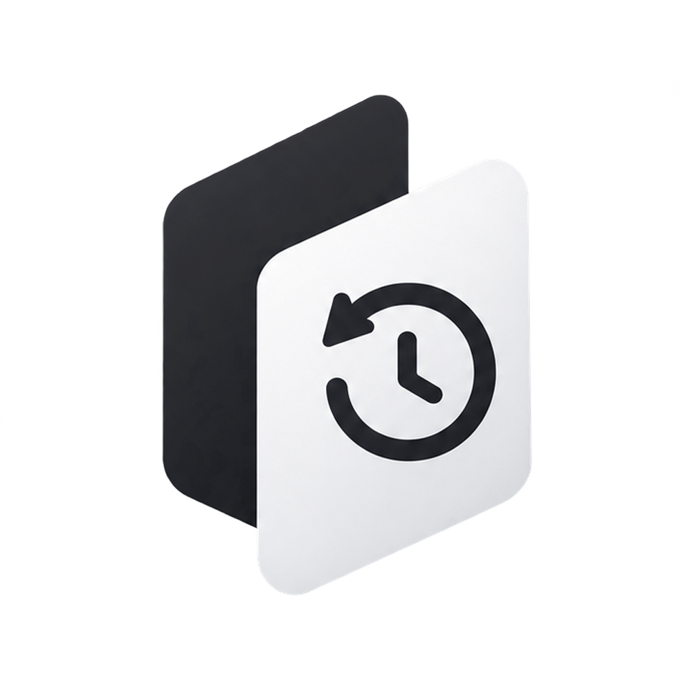

<p align="center">
  
</p>

<h1 align="center">Sync Disk</h1>

<p align="center">
  <strong>Native macOS Real-Time External Disk Mirror & Continuous Version History Manager</strong>
</p>

<p align="center">
  
  
  
  
  
</p>

---

## ⚡ Overview

**Sync Disk** is a lightweight, high-performance macOS menu bar utility that continuously mirrors selected folders to external storage (such as SanDisk Extreme, Samsung T7/T9, USB drives, or NAS mounts) while maintaining a complete, point-in-time recoverable version history.

Designed specifically for macOS Sonoma and Sequoia, Sync Disk pairs seamless FSEvents streaming with an append-only, crash-resilient file history engine—ensuring you never lose a file version while preserving maximum local disk space.

---

## ✨ Features

- **Continuous Real-Time Mirroring**: Low-latency file synchronization powered by native macOS `FSEventStream`. Changes are debounced and streamed to external storage instantly.
- **Zero-SQLite File-Based History Engine**: Robust, pure-Swift history storage utilizing Content-Addressable Storage (CAS) with SHA-256 deduplication and atomic JSON journals. Fast, portable, and zero corruption risk.
- **iCloud Drive Space Saver**: Safely triggers local eviction (`evictLocalCopyIfVerified`) on synced iCloud files only after verification, reclaiming internal Mac SSD storage without losing cloud or external backups.
- **Finder-Grade Modern UI**:
  - **Adaptive Icon Grid**: Retina 3D macOS folder icons and instant hardware-accelerated image previews with pixel dimensions.
  - **Dynamic Breadcrumb Path Bar**: Interactive Finder-style bottom breadcrumbs with instant folder jumping.
  - **Version Timeline Inspector**: Complete chronological history of file revisions with diffs, metadata, and one-click file restore.
  - **Adaptive Dock & Menu Bar Icon**: Dynamically matches Sequoia dark/light icon aesthetics.
- **Rename & Conflict Protection**: Intelligent heuristic rename detection and conflict-free copy semantics preserve modifications even when external files are edited manually.
- **Comprehensive Test Suite**: 18 unit tests validating sync safety, deduplication, conflict protection, crash journals, and metrics.

---

## 🚀 Installation

### Instant Install (Recommended)

Download the ready-to-run macOS app (no build tools required):

- 📦 **[Download Sync-Disk.zip](https://github.com/irsubh/Sync-Disk/raw/main/Sync-Disk.zip)** *(~3.0 MB · Native macOS Sonoma & Sequoia)*

1. Download and extract **`Sync-Disk.zip`**
2. Move **`Sync Disk.app`** to your `/Applications` folder
3. Launch **Sync Disk** from Launchpad, Spotlight, or Applications!

---

### Build from Source

#### Prerequisites
- macOS 14.0 (Sonoma) or macOS 15.0+ (Sequoia)
- Xcode Command Line Tools (`xcode-select --install`)
- Swift 5.9+

#### Building
```bash
# Clone the repository
git clone https://github.com/irsubh/Sync-Disk.git
cd Sync-Disk

# Build Release Binary
swift build -c release --product SyncDisk
```

---

## 🏗️ Architecture

```
SyncDisk/
└── Sources/
    ├── SyncDisk/
    │   ├── Core/
    │   │   ├── Sync/        # SyncEngine, FSEventsWatcher, StorageManager, ICloudManager
    │   │   ├── Database/    # HistoryDatabase (File-based, zero-SQLite)
    │   │   ├── Models/      # SyncConfig, FileHistoryEntry, SnapshotManifest
    │   │   └── Storage/     # StorageMetrics, RenameDetector
    │   ├── UI/
    │   │   ├── History/     # HistoryWindowView, FileGridIconView, HistoricalInspectorView
    │   │   ├── Components/  # ThumbnailCache, PathBarView, EmptyStateView
    │   │   ├── MenuBar/     # MenuBarPopupView, MenuBarIconProvider
    │   │   └── Settings/    # SettingsView, OnboardingWindowView
    │   └── App/             # SyncDiskApp, AppDelegate, WindowManager
    └── SyncDiskAppEntry/
        └── main.swift       # Application entry point
```

---

## 🛡️ License

This project is licensed under the **MIT License** — see the [LICENSE](LICENSE) file for details.

### Author

- **Subhankar Mondal** ([@irsubh](https://github.com/irsubh))
- Email: [subhankar.mondal@nodezed.com](mailto:subhankar.mondal@nodezed.com)
- GitHub: [https://github.com/irsubh](https://github.com/irsubh)

